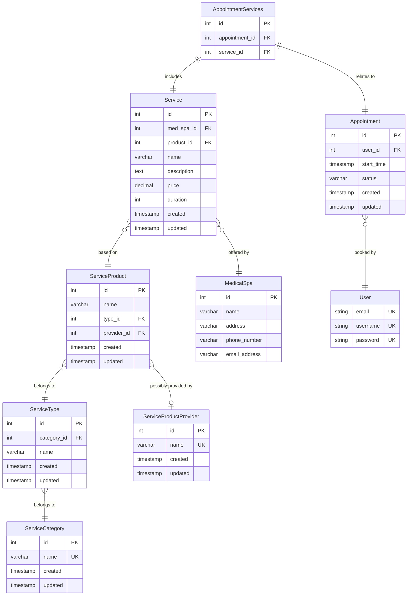

[](https://github.com/laaraujo/medical-spa-api/actions/workflows/tests.yml)
[](https://github.com/laaraujo/medical-spa-api/actions/workflows/build.yml)
[](https://codecov.io/gh/laaraujo/medical-spa-api)

# Medical Spa API

## Tech used

- [DRF](https://www.django-rest-framework.org/) for Django REST API development
- [Makefile](./Makefile) for better local dev experience
- [Djoser](https://djoser.readthedocs.io/) for authentication
- [Whitenoise](https://whitenoise.readthedocs.io/) for serving static files (docs and admin)
- [Docker](https://www.docker.com/) and [Compose](https://docs.docker.com/compose/) for development and production containers
- [PostgreSQL](https://www.postgresql.org/) database
- [DRF Spectacular](https://drf-spectacular.readthedocs.io/) for documentation
- Pre-commit hooks w/ [Ruff](https://docs.astral.sh/ruff/) linter and [OTB Pre-commit hooks](https://github.com/pre-commit/pre-commit-hooks)
- [Pytest](https://docs.pytest.org/) for testing

## Local setup

```sh
git clone git@github.com:laaraujo/medical-spa-api.git # clone this repo
cd medical-spa-api # cd into repository directory
python -m venv .venv # create virtual environment
source .venv/bin/activate # activate virtual environment
pip install -r requirements.txt # install dependencies
pre-commit install # initialize pre-commit hooks
cp .env.example .env # create .env file
make build # build containers
make seed # seed database
```

- Alternatively if for some reason you can't run Makefile targets in your terminal, you can always check [./Makefile](./Makefile) and run the commands yourself. Just make sure to change `DB_HOST=db` to `DB_HOST=localhost` in your `.env` file

## Running locally

```
make run
```

## Testing

The following command should be all you need (while in the root folder of this repo):

```
make test
```

- Keep in mind we are mostly running api endpoint tests so make sure to have the database running (`make run`) in another shell instance

## Make commands

`make help`

```
build .................... : Build local containers
run ...................... : Run local containers
stop ..................... : Stop local containers
down ..................... : Stop and delete local container
makemigrations ........... : Django makemigrations command
migrate .................. : Django migrate command
createsuperuser .......... : Django createsuperuser command
shell .................... : Django shell command
collectstatic ............ : Django collectstatic command
seed ..................... : Seed database with service products and fake data
sh ....................... : SSH into local API container
linter ................... : Run Ruff linter against all files in this repo
test ..................... : Run automated tests
```

## Documentation

API Swagger docs are available in the `/docs/` endpoint (http://localhost:8000/docs/).

## TL;DR

1. Create a user (or create a superuser with `make createsuperuser`)

```bash
curl 'localhost:8000/auth/users/' \
--header 'Content-Type: application/json' \
--data '{
    "username": <username>,
    "password": <password>
}'
```

2. Get your API access token

```bash
curl 'localhost:8000/auth/jwt/create/' \
--header 'Content-Type: application/json' \
--data '{
    "username": <username>,
    "password": <password>
}'
```

```json
{
  "refresh": "<refresh_token>",
  "access": "<access_token>"
}
```

3. Hit any of the `services` or `appointments` endpoints

```bash
curl 'localhost:8000/appointments/' \
--header 'Authorization: Bearer <access_token>'
```

## Possible improvements

- Proper data validation (phone numbers, address, etc)
- Authorization (we are only implementing the user class for authentication so far)
  - Row level permissions (possibly `medspa` level); except for `services` all other entities make no distinction between `medspas`
  - Posibble `unique_together` constraints with `medspa` relationship
- Email validation for user-related actions (registration, password change, etc), I deactivated these on purpose for the sake of simplicity
- Pagination for list endpoints

## ERD


